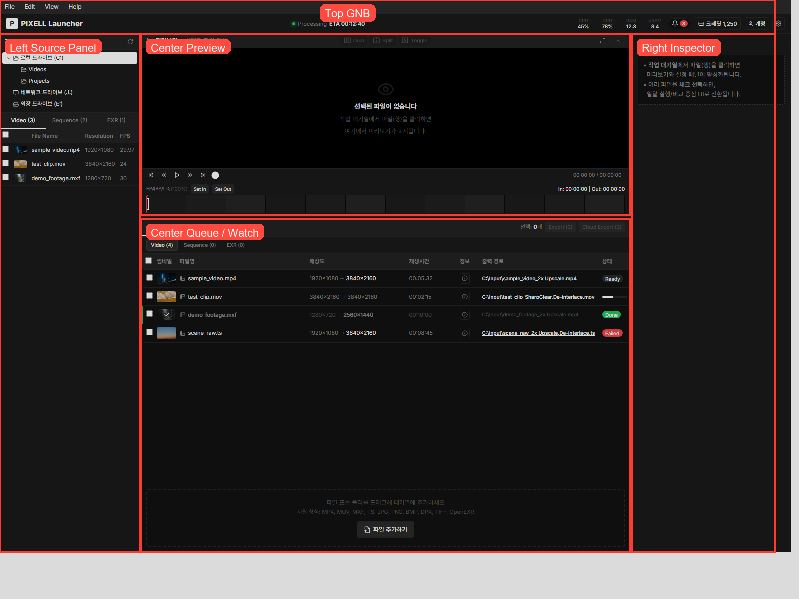
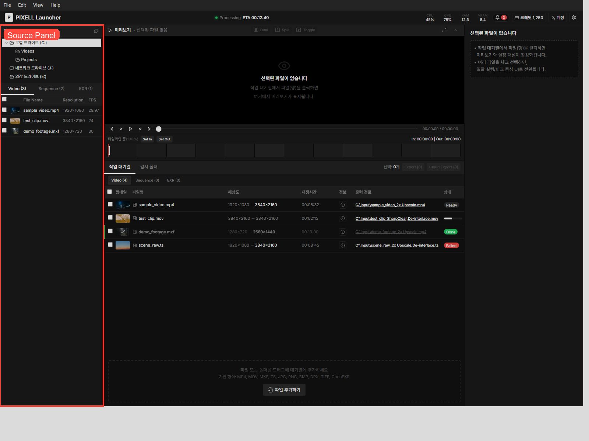
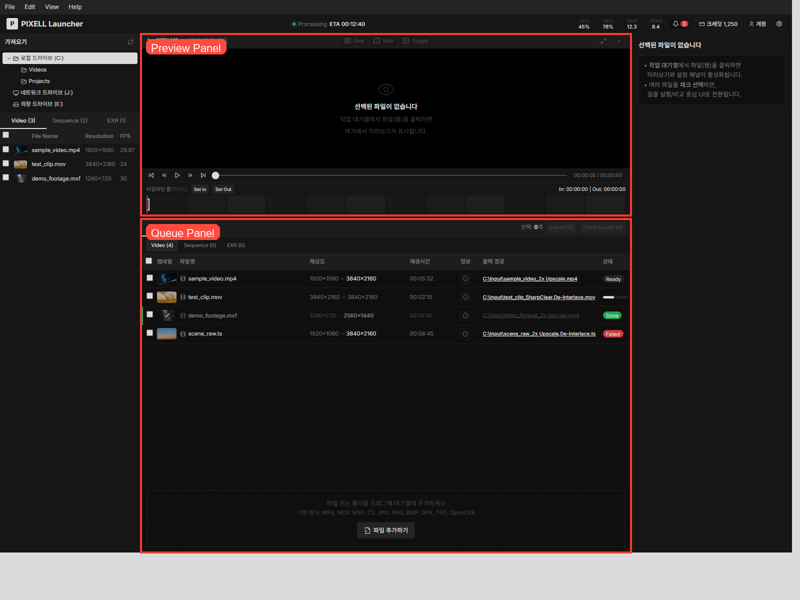

# Pixell Launcher 기능 요구사항 및 개발 핸드오프 가이드

작성일: 2026-04-22 / 최종 수정: 2026-04-28 (AI Models 3축 분리, Output Resolution AI 동기화 드롭다운, Broadcast / Delivery 임시 제거)

> 직전 수정(2026-04-27): 방송 송출용 Export 옵션 반영.

> 본 문서는 디자인 확정 산출물이자, 개발 구현을 위한 단일 source of truth로 사용한다.
> UI/기능 미리보기는 `npm install` 후 `npm run dev`로 실행하거나, `npm run build` 후 생성되는 `dist/index.html`을 더블클릭해 확인한다.
> Export 옵션 → ffmpeg 커맨드 매핑은 `ffmpeg-command-mapping.md` 참조.


## 제품 한 줄 정의

Pixell Launcher는 영상/시퀀스/EXR 소스를 불러와 Queue에 올리고, AI 모델과 출력 설정을 적용한 뒤, Preview와 Metadata 비교를 거쳐 Export를 실행하는 데스크톱형 런처 UI다.

## 한눈에 보는 기능 요약

| 구분 | 기능 요구사항 | 현재 버전 반영 상태 | 디자인 관점 요약 | 비고 |
| --- | --- | --- | --- | --- |
| 전체 구조 | 상단 GNB + 좌측 Source + 중앙 Preview/Queue + 우측 Inspector | 반영 | 3열 작업형 레이아웃으로 확정 필요 | 데스크톱 중심 |
| GNB | 시스템 상태, 크레딧, 계정, 설정 | 반영 | 정보 우선순위와 팝업 구조 확정 | 수치는 데모 |
| Source Panel | 드라이브/폴더 탐색, 파일 리스트, 탭 분리 | 반영 | 탐색 트리와 리스트 밀도 확정 | 샘플 데이터 기반 |
| 소스 유형 | Video / Sequence / EXR 분리 | 반영 | 탭 구조와 유형별 컬럼 확정 | |
| 소스 액션 | 체크 선택, 다중 선택, Queue 추가 | 반영 | 선택 상태와 액션 노출 규칙 확정 | Format 컬럼 포함 |
| 드래그앤드롭 | Source에서 Queue로 드롭 추가 | 반영 | Drag over / drop zone 표현 필요 | 브라우저 내 데모 |
| Preview | Before/After 비교, 줌, 팬, 타임라인, Trim | 반영 | 핵심 검토 패널로 시각 비중 확정 | Dual / Split / Toggle 모드 추가 |
| Fullscreen Preview | 전체화면 비교 보기 | 반영 | 전체화면에서도 컨트롤 유지 범위 확정 | |
| Queue | 작업 목록, 상태, 파일 정보, 선택 관리 | 반영 | 메인 테이블 구조와 상태 스타일 확정 | |
| Queue 필터 | Video / Sequence / EXR 필터 | 반영 | 보조 탭/세그먼트 구조 확정 | |
| Watch | 감시 폴더 상태 표와 상세 설정 편집 | 반영 | 보조 탭이지만 상태/설정 패널 구조 확정 필요 | 실제 감시 미연동 |
| EXR | Single/Multi Layer 구분, 레이어 선택 상태 | 반영 | EXR 전용 표시 밀도 확정 | 정적 규칙 기반 |
| AI Models | Upscaler(Off/2x/4x), Edge Enhancement, De-interlace | 반영 | 3축 독립 컨트롤(드롭다운 1 + 토글 2)로 단순화 | Denoise · SharpClear 표기는 본 버전에서 제거(추후 재검토) |
| 모델 도움말 | 툴팁, 설명 모달 | 반영 | 정보형 도움말 구조 확정 | |
| Export Settings | 해상도, 코덱, 컨테이너, Profile, Quality, 오디오, 비트레이트, 타임코드 | 반영 | 코덱 기반 동적 옵션 + Bitrate(고급) | 실제 인코딩 미연동 |
| 코덱 기반 동적 옵션 | 코덱 선택에 따라 Container/Profile/AudioCodec 후보 자동 한정 | 반영 | ProRes→MOV·XAVC→MXF·VP9→deadline 등 SaaS 매핑과 일치 | |
| Output Resolution 드롭다운 | AI 모델 결과 그룹 + 표준 규격 그룹 분리, 오버라이드 힌트 | 반영 | AI 선택과 일치하는 항목만 동적 노출, 표준 항목 선택 시 파이프라인 힌트 표기 | 본 버전 신규 |
| 방송 송출 옵션 | Color Space/Range, GOP, Loudness 등 Broadcast / Delivery 영역 | **임시 제거** | UI 미노출, 데이터 모델·기본값은 보존 | 추후 재도입 예정 |
| 조건부 필드 | Custom 해상도, Audio Bitrate, ProRes/XAVC 강제값, Output Resolution AI 그룹 동적 노출 등 | 반영 | 조건부 노출 시 레이아웃 변화 정리 필요 | |
| Preset | 조회, 생성, 수정, 복제, 삭제 | 반영 | 카드형 관리 구조 유지 여부 확정 | 영속 저장 미연동 |
| Metadata | 단일 상세 비교, 다중 비교 | 반영 | 비교 테이블과 아코디언 구조 확정 | |
| Export Review | Before/After 최종 검토 및 수정 | 반영 | 변경값 강조 방식 확정 | |
| Export | Export Start 흐름 | 반영 | 최종 실행 CTA 구조 확정 | 큐 상태 갱신 수준 |
| Cloud Export | Cloud Export 버튼/로그 | 부분 반영 | 버튼 위치와 상태만 우선 정의 | 실제 업로드 미연동 |
| Event Log | INFO/WARN/ERROR 로그 모달 | 반영 | 보조 모달로 간결하게 유지 | 실시간 로그 아님 |

---

## 1. 전체 화면 구조

## 화면 구성 원칙

- 상단: 전역 상태와 계정/설정 진입
- 좌측: 소스 탐색 및 소스 선택
- 중앙 상단: Preview
- 중앙 하단: Queue 또는 Watch
- 우측: 선택 항목 기준 AI Models, Export Settings, 실행 액션

## 와이어프레임 기준 레이아웃

| 영역 | 역할 | 디자인 확정 포인트 |
| --- | --- | --- |
| Top GNB | 전역 상태, 크레딧, 계정, 설정 | 항상 고정 노출할지, 정보 밀도와 우선순위를 확정 |
| Left Source Panel | 드라이브/폴더 탐색, 파일 목록, Queue 추가 | 탐색 구조와 파일 리스트 정보 밀도 확정 |
| Center Preview Panel | Before/After 비교, 뷰 모드, 줌, 타임라인, Trim | 가장 중요한 시각 확인 영역으로 확정 |
| Center Bottom Panel | Queue / Watch 탭 | 표 중심 구조와 툴바 구조 확정 |
| Right Inspector Panel | Queue 선택 편집 또는 Watch 선택 편집 | 컨텍스트 전환형 편집 패널로 확정 |

## 레이아웃 관련 결정 요청

- Preview와 Queue의 시각적 비중은 Preview 우선으로 확정
- Right Inspector는 "선택한 1개 항목을 상세 편집"하는 구조로 확정
- 다중 선택 시 Right Inspector는 편집보다 요약/제한 안내 중심으로 확정

### 화면 참조



---

## 2. 사용자 흐름

## 기본 사용 흐름

1. 사용자가 좌측 Source Panel에서 파일을 탐색한다.
2. 파일을 체크하거나 드래그해서 Queue에 추가한다.
3. Queue에서 항목을 선택한다.
4. 우측 Inspector에서 AI Models와 Export Settings를 조정한다.
5. 중앙 Preview에서 Before/After와 Trim을 검토한다.
6. 필요 시 Metadata Compare 또는 Export Review를 확인한다.
7. Export 또는 Cloud Export를 실행한다.

## 디자인적으로 반드시 보장할 흐름

- Source -> Queue 추가
- Queue 선택 -> 우측 설정 반영
- Queue 선택 -> Preview 반영
- Queue 선택 -> Metadata 확인
- Queue 선택 -> Export Review -> Export Start

---

## 3. 화면/패널별 요구사항

## 3-1. Top GNB

### 목적

전역 상태와 계정성 기능을 제공하는 상단 바.

### 포함 기능

- CPU / GPU / RAM / VRAM 상태 표시
- 크레딧 표시
- 계정 메뉴
- 설정 메뉴
- 외부 링크 툴팁

### 배치 원칙

- 시스템 상태는 한 줄에서 빠르게 읽히는 형태
- 계정/설정은 우측 정렬
- 팝업 메뉴는 드롭다운 형태 유지

### 인터랙션

- 클릭 시 팝업 메뉴 오픈
- 바깥 영역 클릭 시 닫힘
- 링크 영역 hover 시 툴팁 노출

### 디자인 확정 포인트

- 상태 수치의 시각 강조 정도
- GNB 아이템 간 우선순위
- 메뉴 팝오버 폭과 정보 밀도

---

## 3-2. Left Source Panel

### 목적

입력 소스를 탐색하고 Queue에 올릴 파일을 선택하는 영역.

### 포함 기능

- 드라이브/폴더 트리 탐색
- Video / Sequence / EXR 탭 전환
- 파일 리스트 표시
- 체크 선택
- 다중 선택
- Queue에 추가 버튼
- 파일 드래그 시작

### 현재 표시 정보

- 파일명
- 해상도
- 비디오인 경우 FPS, Duration
- 시퀀스인 경우 Frame 정보, Date
- EXR인 경우 Layer Type, Selected Layer

### 인터랙션

- 탭 전환 시 해당 유형 리스트만 노출
- 체크박스로 다중 선택 가능
- 선택 수가 1개 이상일 때 하단 "대기열에 추가" 액션 노출
- 파일 행을 드래그해서 Queue로 드롭 가능

### 디자인 확정 포인트

- 폴더 트리와 파일 리스트의 시각적 분리 방식
- 행 hover / selected / checked 상태
- 탭 구조를 세그먼트로 할지, 상단 라인 탭으로 할지
- 파일명 길이 초과 시 처리 방식

### 상태 정의

| 상태 | 설명 |
| --- | --- |
| 기본 | 아무 파일도 선택하지 않은 상태 |
| Hover | 행에 포인터가 올라간 상태 |
| Checked | 체크박스로 선택된 상태 |
| Dragging | Queue로 드래그 중인 상태 |
| Empty | 해당 폴더에 해당 유형 파일이 없는 상태 |

### 화면 참조



---

## 3-3. Center Preview Panel

### 목적

선택한 Queue 항목의 결과를 시각적으로 검토하는 핵심 패널.

### 포함 기능

- Before / After 비교
- Preview 모드 전환
- `Dual`
- `Split`
- `Toggle`
- 줌 인/아웃
- 팬
- 줌 배율 표시
- Reset View
- Fullscreen Preview
- 타임라인
- 타임라인 줌
- Trim In / Trim Out 핸들
- Preview 접기/펼치기

### 인터랙션

- 마우스 휠로 줌
- 줌 상태에서 포인터 기준 pan
- `Dual / Split / Toggle` 버튼으로 비교 방식 전환
- `Split` 모드에서 가운데 디바이더 드래그
- `Toggle` 모드에서 클릭으로 Before/After 전환
- Reset 버튼으로 원위치
- Fullscreen 버튼으로 전체화면 모달 진입
- 타임라인 하단에서 In/Out 핸들 드래그

### 디자인 확정 포인트

- Before/After 비교 방식의 기본 레이아웃
- `Dual / Split / Toggle` 모드 버튼의 시각적 우선순위
- 선택 없음 상태에서 Preview 상단 컨트롤 비활성 표현
- 타임라인과 Trim 핸들의 가시성
- Fullscreen 모드에서 유지할 컨트롤 범위

### 상태 정의

| 상태 | 설명 |
| --- | --- |
| No Selection | 선택된 Queue 항목이 없을 때 기본 프리뷰 |
| Default View | 줌 100% 상태 |
| Zoomed | 100% 초과 확대 상태 |
| Trim Editing | In/Out 핸들을 조정하는 상태 |
| Fullscreen | 전체화면 비교 상태 |
| Collapsed | Preview 패널 축소 상태 |

### 화면 참조



---

## 3-4. Center Bottom: Queue

### 목적

작업 대상 목록을 관리하고 각 항목의 상태를 확인하는 메인 작업 테이블.

### 포함 기능

- Queue / Watch 탭 전환
- Queue 내부 Video / Sequence / EXR 필터
- 전체 선택 / 개별 선택
- 상태 표시
- 썸네일, 파일명, 해상도, 재생시간, 정보, 출력 경로, 상태 표시
- Metadata 상세 진입
- EXR 레이어 선택 상태 표시
- 컬럼 폭 조절
- Drop Zone 표시

### 인터랙션

- 행 클릭 시 해당 항목 선택
- 체크박스는 다중 선택용
- 다중 선택 시 Metadata Compare 가능
- 드래그 중 Queue 영역에 진입하면 Drop Zone 강조
- 드롭 시 Queue에 항목 추가

### 디자인 확정 포인트

- 행 선택과 체크 선택의 시각적 차이
- 상태 배지 스타일
- 드롭존 노출 방식
- EXR 유형에서 레이어 정보 표시 밀도
- Queue 툴바와 테이블 헤더 구조

### 상태 정의

| 상태 | 설명 |
| --- | --- |
| None Selected | 아무 항목도 선택되지 않음 |
| Row Selected | 한 행이 상세 편집 대상으로 선택됨 |
| Multi Checked | 여러 행이 체크되어 일괄 동작 가능 |
| Drag Over | 파일 드롭 가능 상태 강조 |
| Empty Queue | Queue가 비어 있는 상태 |

---

## 3-5. Center Bottom: Watch

### 목적

감시 폴더 기반 자동 처리 구성을 보고, 선택한 감시 폴더의 상태와 설정을 함께 편집하는 탭.

### 포함 기능

- 감시 폴더 경로
- 폴더명
- Applied Settings
- Output Path
- Watch Status
- Current Activity
- Detected Files
- 선택한 감시 폴더의 상태 카드
- 선택한 감시 폴더의 작업 현황 카드
- 선택한 감시 폴더의 적용 설정 요약

### 인터랙션

- Watch 테이블에서 행 선택
- 선택 시 상단 Preview 영역이 감시 폴더 상태 카드 뷰로 전환
- 우측 Inspector가 감시 폴더 설정 편집 모드로 전환
- 저장된 설정이 있는 경우 실행 / 중지 버튼 활성화
- 활성 상태에서는 편집 비활성, 중지 후 다시 편집 가능

### 디자인 확정 포인트

- Watch는 단순 표가 아니라 `목록 + 상단 상태 요약 + 우측 편집 패널` 구조로 확정
- Active / Paused / Error 상태의 시각 구분 명확화
- Queue와 Watch 간 동일 레이아웃을 유지하되, 상단 Preview 내용만 문맥적으로 바꾸는 구조 유지

### 비고

- 현재는 샘플 데이터 기반 UI
- 실제 폴더 감시 설정/편집 UX는 향후 확장 가능

---

## 3-6. Right Inspector: AI Models

### 목적

선택한 Queue 항목 또는 선택한 Watch 폴더에 적용할 AI 처리 옵션을 제어하는 패널.

### 데이터 모델

```ts
type UpscalerLevel = "off" | "2x" | "4x";

interface ModelSettings {
  upscaler: UpscalerLevel;
  edgeEnhancement: boolean;
  deinterlace: boolean;
}
```

세 차원이 서로 독립적이며 동시에 적용 가능. 직전 버전의 단일 enum 코어 모델(`1x_denoise`/`1x_sharpclear`/`2x_sharpclear`/`2x_upscale`/`4x_upscale`)과 Denoise 옵션은 제거. 레거시 데이터는 `buildModelSettingsFromLegacy()`로 마이그레이션.

### UI 구성

`AI Models` 단일 Section 헤더 아래에 세 개 행을 배치(Export Settings 섹션과 동일한 위계). 라벨 폭 110px, 우측 컨트롤 정렬.

| 라벨 | 컨트롤 | 옵션 / 동작 |
| --- | --- | --- |
| Upscale | dropdown | `Off` / `2x` / `4x` (택1) |
| Edge Enhancement | toggle | on/off |
| De-interlace | toggle | on/off |

### 인터랙션

- Upscale 드롭다운에서 배율 변경 → 상위 단계 출력 해상도 자동 갱신(아래 Export Settings 참조)
- Edge Enhancement / De-interlace 토글 단독 on/off
- 헤더 우측 도움말 아이콘 클릭 시 `AI Model Guide` 모달 진입(Upscaler 2x/4x, Edge Enhancement, De-interlace 4개 항목으로 재구성)
- 행 hover 시 `modelTooltipInfo[upscaler|edgeEnhancement|deinterlace]` 툴팁

### 디자인 확정 포인트

- Upscale 드롭다운 폭은 InlineSelectField 표준(`flex-1`)에 맞춤
- 토글과 드롭다운이 한 섹션에 혼합되므로 행 간 수직 정렬 일관성 유지
- 비활성(잠금) 상태에서 opacity 0.45 + pointerEvents none 적용

### 상태 규칙

- Queue 단일 선택 시 편집 가능
- Queue 다중 체크 상태에서는 AI Models 섹션 자체를 숨김(다중 가이드 안내로 대체)
- Watch 폴더 선택 시 Watch 전용 편집 모드로 전환
- Watch가 Active 상태이면 편집 잠금
- Queue 항목이 Done / Processing 상태이면 read-only

### 변경 이력

- v0.1 → 현재: 다중 토글(Upscale / SharpClear / Denoise / De-interlace) → 단일 enum 코어 모델 → 3축 분리(Upscaler / Edge Enhancement / De-interlace)로 두 차례 단순화
- "SharpClear" 표기 → "Edge Enhancement"로 변경(내부 필드명 `edgeEnhancement`)
- "Denoise" 카테고리 본 버전에서 제거(차후 복귀 검토)
- 강도(Light / Strong) 개념 제거 — Upscaler 배율로 흡수

---

## 3-7. Right Inspector: Export Settings

### 목적

Queue 항목 또는 Watch 폴더의 출력 포맷과 인코딩 관련 옵션을 설정하는 패널.
방송국 TV 송출용으로 사용되는 것이 주 타깃이므로, SaaS PMS의 ffmpeg 매핑을 그대로 옮긴 위에 방송 딜리버리에 필요한 옵션을 추가로 포함한다.

### 패널 구성 (2 그룹)

1. **기본 출력 옵션** — 항상 노출
2. **Bitrate Setting (Advanced)** — 접이식, ProRes·XAVC에서는 숨김

> 직전 버전의 **Broadcast / Delivery** (Color Space / Color Range / Keyframe(GOP) / Loudness / Target LUFS) 접이식 섹션은 본 버전에서 임시 제거. UI만 미노출 상태이며 `ExportDraft` 데이터 모델·기본값·옵션 상수(`COLOR_SPACE_OPTIONS`, `LOUDNESS_TARGET_OPTIONS` 등)는 그대로 보존되어 추후 UI 블록만 다시 부착하면 복원 가능.

### 1) 기본 출력 옵션

행 표시 순서는 **Resize 토글 → (OFF 시) Output Resolution 읽기전용 → (ON 시) Output Resolution 드롭다운 → Custom W/H → Scaling Mode → Aspect Ratio → Frame Rate 이하…** 로 통일.

| 항목 | 옵션 | 비고 |
| --- | --- | --- |
| Resize | On / Off 토글 | XAVC 코덱 선택 시 강제 On |
| Output Resolution (Resize OFF) | 읽기전용 텍스트 | AI Upscaler 배율로 자동 계산. 큐 패널은 `${source × N}` 픽셀 표기, Watch 폴더는 `Source` / `Source × 2` / `Source × 4` 공식 표기 |
| Output Resolution (Resize ON) | optgroup 드롭다운 (아래 별도 표) | 본 버전에서 옵션 구조 변경. XAVC는 3840x2160 강제 |
| Custom Width / Height | 숫자 입력 | Resolution=Custom일 때만 노출 |
| Scaling Mode | Scale to Fit / Stretch to Fill | Resize On일 때만 노출. **Output Resolution 아래로 이동** |
| Aspect Ratio | Originals / Square Pixels (1.0) / DV NTSC (0.9091) / DV NTSC 16:9 (1.2121) / DV PAL (1.0940) / DV PAL 16:9 (1.4587) / Anamorphic 2:1 (2.0) / HD Anamorphic (1.333) / DVCPRO HD (1.5) | Resize On일 때만 노출. XAVC는 비활성 |
| Frame Rate | Original / 23.976 / 24 / 25 / 29.97 / 30 / 50 / 59.94 / 60 fps | XAVC는 비활성 (코덱 강제 fps 사용) |
| Scan Type | Progressive / Interlaced TFF (Top first) / Interlaced BFF (Bottom first) | 방송 송출 시 인터레이스 자주 사용 |
| Video Codec | H.264 / H.265 (HEVC) / VP9 / Apple ProRes / XAVC 59.94 / XAVC 29.97 | 코덱 변경 시 Container/Profile/Audio 후보 자동 갱신 |
| Container | 코덱별 동적 (아래 표) | 후보가 1개면 비활성 |
| Profile | 코덱별 동적 (아래 표) | XAVC는 미노출 (OMX 프리셋 강제) |
| Quality | Low / Good / Best | ProRes·XAVC에서는 미노출. Bitrate(Advanced) 열려 있으면 비활성 |
| Audio Codec | 코덱별 동적 (아래 표) | 후보가 1개면 비활성 |
| Audio Bitrate | 64 / 80 / 96 / 112 / 128 / 160 / 192 / 224 / 256 / 320 kbps | Audio Codec이 Copy 또는 PCM이면 미노출 |
| Audio Channels | Mono / Stereo / 5.1 Surround / 8 ch Discrete (Broadcast) | 8ch는 방송 마스터 PCM 다중 트랙용 |
| Sample Rate | 44.1 / 48 / 96 kHz | 방송 기본 48 kHz |
| Timecode Mode | Non-drop frame (NDF) / Drop frame (DF) | DF 선택 시 ffmpeg `-timecode 00:00:00;00` |

#### Output Resolution 드롭다운 (본 버전 신규)

`<optgroup>` 으로 두 그룹 분리. AI Models 섹션의 Upscale 선택과 양방향 동기화.

**From AI Models** — 현재 Upscale 선택과 일치하는 항목만 동적 노출

| 조건 | 표시 항목 | 내부 값 |
| --- | --- | --- |
| 항상 | `${sourceRes} (Original)` (큐) / `Source (Original)` (Watch) | `ai:original` |
| Upscale = 2x | `${source × 2} (2x AI Upscale)` / `Source × 2 (2x AI Upscale)` | `ai:2x` |
| Upscale = 4x | `${source × 4} (4x AI Upscale)` / `Source × 4 (4x AI Upscale)` | `ai:4x` |

**Standard** — 고정 목록(레이블에 송출 규격명 병기)

```
640x480   (480p SD NTSC)
768x576   (SD PAL)
1280x720  (720p HD)
1920x1080 (1080p FHD)
3840x2160 (2160p 4K)
7680x4320 (4320p 8K)
Custom
```

> 직전 버전의 단순 목록(`720x480 / 1280x720 / 1920x1080 / 3840x2160 / 7680x4320 / Custom`)에서 **NTSC 480p(640x480)·SD PAL(768x576) 추가 + 송출 규격 라벨 병기**로 변경.

#### 동기화 규칙

- 메인 컨트롤은 AI Models 섹션의 Upscale. Resize 드롭다운의 AI 그룹은 같은 설정의 두 번째 진입점.
- AI Models의 Upscale 변경 → 현재 `resolutionPreset`이 `ai:*` 태그면 새 AI 레벨에 맞게 자동 마이그레이션. 사용자가 명시적으로 고른 표준 해상도 / Custom은 보존.
- Resize 토글 ON 전환 시 기본 선택값 = 현재 AI에 매칭되는 `ai:*` 태그(자연 출력 유지, 토글 직후 출력 해상도 변동 없음).

#### 오버라이드 힌트

조건: `Resize = ON` AND `AI ≠ Off` AND `선택값이 AI 자연 출력과 다름`.

표시: 드롭다운 바로 아래 한 줄
- 폰트 11px, accent 색상 + 굵게 600, `Info` 아이콘 prefix
- 형식: `AI 2x → Resize to 1280x720`
- AI = Off 상태이거나 AI 자연 출력과 일치하면 비표시

목적: 표준 그룹의 항목을 골랐거나 `ai:original`로 다운스케일하는 등 AI 결과를 후처리로 강제 변경하는 케이스를 명시(송출 규격 다운스케일·Aspect 보정 등 의도된 오버라이드).

#### 출력 해상도 계산 우선순위 (`getDraftOutputRes` / `getOutputRes`)

1. Resize OFF → `source × AI 배율`
2. Resize ON + `ai:*` 값 → 해당 AI 배율로 환산
3. Resize ON + `Custom` → `customWidth × customHeight`
4. Resize ON + 표준 해상도 → 그대로 사용

(직전 버전의 "AI factor > 1이면 resize 무시" 동작을 본 버전에서 수정.)

#### 코덱별 동적 옵션 매트릭스

| Video Codec | Container 후보 | Profile 후보 | Audio Codec 후보 | 특이 사항 |
| --- | --- | --- | --- | --- |
| H.264 | MP4 / MOV / MKV | High / Main | Copy / AAC | |
| H.265 (HEVC) | MP4 / MOV / MKV | Main / Main10 | Copy / AAC | Main10 → 10-bit 픽셀 포맷 |
| VP9 | MP4 / MOV / MKV | Good (deadline=good) / Best (deadline=best) | Copy / AAC / OPUS | Profile 키는 ffmpeg `-deadline`으로 매핑 |
| Apple ProRes | MOV (강제) | 422 Proxy / 422 LT / 422 / 422 HQ / 4444 / 4444 XQ | Copy / PCM | Quality·Bitrate 영역 미노출. Profile은 숫자(0-5) 매핑 |
| XAVC 59.94 | MXF (강제) | (미노출) | Copy (강제) | Resize 강제 On + 3840x2160 + fps=60000/1001. OMX 백엔드 |
| XAVC 29.97 | MXF (강제) | (미노출) | Copy (강제) | 동일, fps=30000/1001 |

> HLS(`ts` 컨테이너)는 본 화면에서 후보 목록에서 숨김. HLS 출력은 별도 ExportSettingLive 화면에서 입력한다.

### 2) Bitrate Setting (Advanced) — 접이식

ProRes·XAVC에서는 토글 자체를 숨김. H.264/H.265/VP9에서만 노출.

| 항목 | 옵션 | 비고 |
| --- | --- | --- |
| Bitrate Mode | VBR / CBR | |
| Target Mbps | 숫자 입력 | |
| Max Mbps | 숫자 입력 | CBR 선택 시 비활성 (Target과 동일값으로 적용) |
| 2-pass Encoding | 토글 | VBR + 2-pass 시 ffmpeg pass 1/2 분리 호출 |

> Advanced를 열면 Quality 셀렉터는 비활성. (코덱 매핑상 Profile 인자는 Advanced 모드에서만 ffmpeg에 전달됨)

### 인터랙션 (요약)

- 코덱 변경 시 Container/Profile/Audio Codec 후보가 즉시 재계산되고, 현재 값이 후보에 없으면 첫 유효값으로 자동 스냅
- XAVC 선택 시: Resize 자동 On + 3840x2160 강제, FPS·Aspect Ratio 비활성, Audio Copy 강제, Advanced 닫힘
- ProRes 선택 시: Container=MOV 고정, Quality/Advanced 미노출, Profile에 6종 ProRes 노출, Audio는 Copy/PCM
- VP9 선택 시: Profile 라벨에 `(deadline=good/best)` 명시 (실제 ffmpeg 인자는 `-deadline`)
- Audio Codec=Copy 또는 PCM이면 Audio Bitrate 미노출
- Bitrate Mode=CBR 선택 시 Max Mbps 비활성 (Target만 사용)
- AI Models의 Upscale 변경 시 Output Resolution이 `ai:*` 태그면 자동 마이그레이션 (사용자가 고른 표준값/Custom은 보존)
- Resize ON 전환 시 기본 선택값은 현재 AI에 매칭되는 `ai:*` 태그
- 선택 해상도가 AI 자연 출력과 다른 경우 드롭다운 아래에 오버라이드 힌트(`AI 2x → Resize to 1280x720`) 노출

### 디자인 확정 포인트

- 기본 옵션과 Advanced 영역의 시각적 구분 (접이식 헤더 색 대비)
- 입력 필드와 셀렉트의 폭 규칙 (110px 라벨 + 가변 input)
- 코덱 변경에 따른 옵션 자동 스냅 시 시각적 피드백 (강조/하이라이트 여부)
- 후보가 1개뿐일 때 disabled 셀렉트의 배경 처리
- 오버라이드 힌트는 accent 색상 + 굵게 + Info 아이콘으로 가독성 확보 (text-3 회색은 배경 대비 부족)

### 상태 규칙

- Queue 단일 선택 시 편집 가능
- Queue 다중 체크 상태에서는 세부 편집 제한
- Watch 선택 시 Watch 전용 Export Settings 폼으로 전환
- Watch Active 상태에서는 편집 잠금
- 선택 없음 상태에서는 가이드 문구 중심
- Done/Processing 상태의 Queue 항목은 read-only

---

## 3-8. Action Area

### 목적

현재 선택 항목 기준으로 주요 작업을 실행하는 영역.

### 포함 기능

- Duplicate
- Export
- Cloud Export

### 인터랙션

- Duplicate는 선택된 Queue 항목 복제
- Export는 Export Review를 거쳐 시작
- Cloud Export는 현재 데모 수준 버튼

### 디자인 확정 포인트

- 기본 우선순위는 Export > Cloud Export > Duplicate
- 버튼 크기와 강조 순위 명확화
- 실행 불가 상태의 disable 기준 명확화

---

## 4. 모달별 요구사항

## 4-1. Metadata Details

### 목적

Queue 항목의 before/after 메타데이터 상세 비교.

### 포함 기능

- 섹션별 접기/펼치기
- before / after 비교

### 확정 포인트

- 표 기반 비교 UI 유지
- 섹션 헤더는 접기 가능한 아코디언 구조 유지

## 4-2. Metadata Compare

### 목적

다중 선택 항목의 메타데이터를 나란히 비교.

### 포함 기능

- 선택 항목 수 표시
- 파일별 예상 출력 정보 비교

### 확정 포인트

- 다중 선택 전용 모달로 확정
- 스캔성이 좋은 테이블 중심 유지

## 4-3. Export Review

### 목적

Export 직전, 변경되는 값을 최종 검토하고 수정하는 단계.

### 포함 기능

- before / after 비교
- 변경된 값 강조
- 일부 항목 직접 수정
- Export Start

### 확정 포인트

- 이 모달은 "최종 확인 단계"로 명확히 인지되도록 디자인
- 변경점 강조가 가장 중요


## 5. 상태별 UX 규칙

## 선택 상태

| 상태 | UI 규칙 |
| --- | --- |
| 선택 없음 | 우측 Inspector는 비활성 또는 안내 상태 |
| 단일 선택 | AI Models / Export Settings 편집 가능 |
| 다중 체크 | 비교/일괄 실행 중심, 세부 편집 제한 |

## 버튼 상태

| 버튼 | 활성 조건 |
| --- | --- |
| 대기열에 추가 | Source 선택 항목 1개 이상 |
| Metadata Compare | Queue 체크 항목 2개 이상 |
| Export | 단일 선택 시 우측 실행 버튼, 다중 선택 시 상단 일괄 버튼 |
| Cloud Export | 현재는 버튼 노출 유지, 실제 처리 여부와 분리 |

## 조건부 노출

| 조건 | 노출 변화 |
| --- | --- |
| Resize OFF | Output Resolution 읽기전용 한 줄 노출 (큐: `${source × N}` / Watch: `Source × N` 공식 표기) |
| Resize ON | Output Resolution(드롭다운, optgroup 분리) / Custom W/H / Scaling Mode / Aspect Ratio 순서로 노출 |
| AI Upscale = 2x | Output Resolution 드롭다운 AI 그룹에 `${source × 2} (2x AI Upscale)` 추가 노출 |
| AI Upscale = 4x | Output Resolution 드롭다운 AI 그룹에 `${source × 4} (4x AI Upscale)` 추가 노출 |
| Resize ON + AI ≠ Off + 선택값이 AI 자연 출력과 다름 | 드롭다운 아래 accent 색 굵은 글씨로 오버라이드 힌트(`AI 2x → Resize to 1280x720`) 노출 |
| Resolution = Custom | Width / Height 입력 노출 |
| Codec = Apple ProRes | Container=MOV 고정, Quality/Advanced 미노출, Profile에 6종 ProRes 노출, Audio는 Copy/PCM만 |
| Codec = XAVC 59.94 / 29.97 | Container=MXF 고정, Resize 강제 On + 3840x2160, FPS·Aspect Ratio 비활성, Profile 미노출, Audio=Copy 강제, Advanced 닫힘 |
| Codec = VP9 | Audio Codec 후보에 OPUS 추가, Profile 라벨에 deadline 표기 |
| Audio Codec = Copy 또는 PCM | Audio Bitrate 미노출 |
| Bitrate Mode = CBR | Max Mbps 비활성 (Target만 적용) |
| Advanced Open | Bitrate Mode/Target/Max + 2-pass 노출, 동시에 Quality 비활성 |
| Preview Zoom > 100% | Zoom 배율 표시, Pan 체감 강화 |
| Preview Mode = Split | 중앙 디바이더 드래그 가능 |
| Preview Mode = Toggle | 클릭으로 Before/After 전환 |
| Center Tab = Watch | Preview 영역이 감시 상태 카드 뷰로 전환 |
| Watch Status = Active | Watch 편집 패널 잠금, 중지 버튼 우선 노출 |


## 8. 화면별 기능 요약 표

| 화면/영역 | 핵심 목적 | 주요 기능 | 주요 인터랙션 |
| --- | --- | --- | --- |
| Top GNB | 전역 상태/계정 | 시스템 상태, 크레딧, 계정, 설정 | 클릭 팝업, hover 툴팁 |
| Left Source Panel | 입력 소스 탐색 | 폴더 트리, 타입 탭, 파일 리스트, Queue 추가 | 체크, 탭 전환, 드래그 |
| Preview | 시각 검토 | Before/After, Dual/Split/Toggle, 줌, 팬, 타임라인, Trim | 휠 줌, 드래그, 전체화면 |
| Queue | 작업 목록 관리 | 상태, 파일 정보, 선택, 비교 진입 | 행 선택, 체크, 드롭 |
| Watch | 감시 폴더 모니터링 | 감시 경로, 활동 상태, 적용 설정, 실행/중지 | 행 선택 후 상단/우측 패널 연동 |
| AI Models | 처리 옵션 제어 | Upscaler(Off/2x/4x), Edge Enhancement, De-interlace | 드롭다운 1 + 토글 2, 툴팁, 도움말 모달 |
| Export Settings | 출력 옵션 제어 | 해상도(AI 동기화 드롭다운), AR, 코덱, 컨테이너, Profile, Quality, 오디오, 비트레이트, 타임코드 | 코덱 기반 동적 옵션 + 접이식 Advanced (Broadcast/Delivery 임시 제거) |
| Preset Management | 프리셋 관리 | 목록, 추가, 수정, 복제, 삭제 | 카드 액션 |
| Metadata | 메타데이터 비교 | before/after, 다중 비교 | 모달 진입, 섹션 접기 |
| Export Review | 최종 검토 | 변경값 비교, 수정, Export Start | 항목 수정, 최종 실행 |

---

## 9. 변경 이력

### 2026-04-28

**AI Models 3축 분리**
- 직전 버전의 단일 enum 코어 모델(`1x_denoise` / `1x_sharpclear` / `2x_sharpclear` / `2x_upscale` / `4x_upscale`)을 3축 독립 컨트롤로 재설계
- 새 데이터 모델: `{ upscaler: "off"|"2x"|"4x", edgeEnhancement: boolean, deinterlace: boolean }`
- UI: `AI Models` 단일 Section 헤더 아래 Upscale 드롭다운 + Edge Enhancement 토글 + De-interlace 토글
- "SharpClear" 표기 → "Edge Enhancement"로 변경(필드명 `edgeEnhancement`)
- "Denoise" 카테고리 임시 제거(차후 복귀 검토)
- Light / Strong 강도 개념 폐지 — Upscaler 배율로 흡수

**Output Resolution AI 동기화 드롭다운**
- `<optgroup>` 으로 `From AI Models` 그룹과 `Standard` 그룹 분리
- AI 그룹은 현재 Upscale 선택과 일치하는 항목만 동적 노출(Original 항상 + 2x/4x 조건부)
- 표준 그룹에 송출 규격 라벨 병기(480p SD NTSC, SD PAL, 720p HD, 1080p FHD, 2160p 4K, 4320p 8K)
- 본 버전에서 NTSC 480p(640x480)·SD PAL(768x576) 추가
- AI Models의 Upscale 변경 시 `ai:*` 태그값 자동 마이그레이션
- 오버라이드(AI 자연 출력과 다른 표준 해상도 선택) 시 드롭다운 아래에 `Info` 아이콘 + accent 굵은 글씨로 `AI 2x → Resize to 1280x720` 형식 힌트 표기

**Resize OFF 상태에서 Output Resolution 동적 표시**
- Resize 토글 OFF에도 토글 행 바로 아래에 읽기전용 한 줄로 출력 해상도 표시
- 큐 패널: `${source × AI 배율}` 픽셀 표기, Watch 폴더: `Source × N` 공식 표기

**Resize 패널 행 순서 변경**
- 기존: Scaling Mode → Output Resolution → Custom W/H → Aspect Ratio
- 신규: **Output Resolution → Custom W/H → Scaling Mode → Aspect Ratio**

**Broadcast / Delivery 섹션 임시 제거**
- Export Settings 내 접이식 "Broadcast / Delivery" UI 블록 제거(Color Space / Color Range / Keyframe(GOP) / Loudness / Target LUFS)
- `ExportDraft` 타입의 데이터 필드와 옵션 상수(`COLOR_SPACE_OPTIONS`, `LOUDNESS_TARGET_OPTIONS` 등)는 보존 — 추후 UI 블록만 다시 부착하면 복원 가능
- 토글 상태 `broadcastOpen` 제거

**출력 해상도 계산 로직 정정**
- 직전 버전의 "AI factor > 1이면 resize 무시" 동작을 본 버전에서 수정
- 새 우선순위: Resize OFF → AI 배율 / Resize ON → 드롭다운 값(또는 Custom W/H)

### 2026-04-27
- 방송 송출용 Export 옵션 반영 (Broadcast / Delivery 접이식 섹션 도입 — 본 버전에서 임시 제거됨)

### 2026-04-22
- 최초 작성
